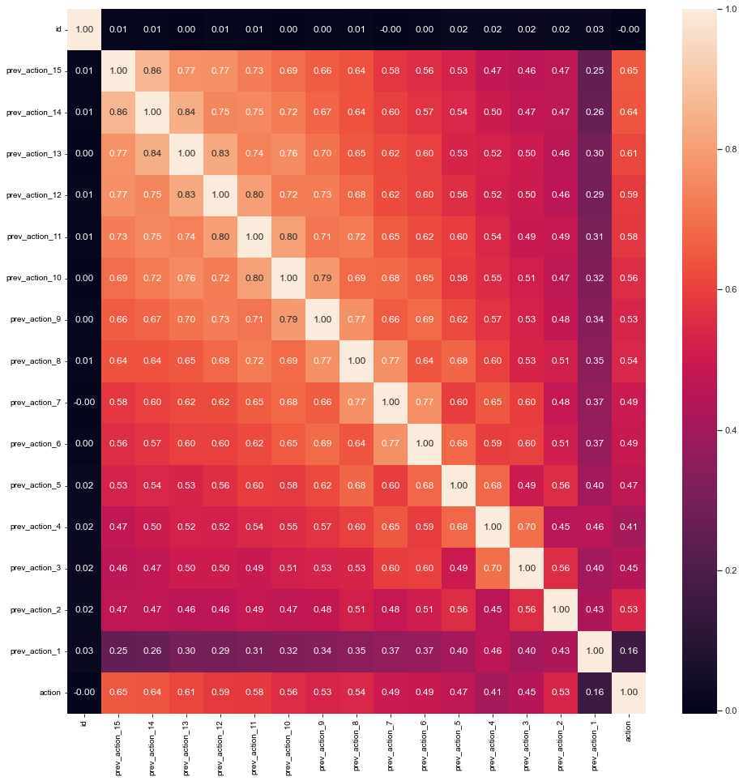
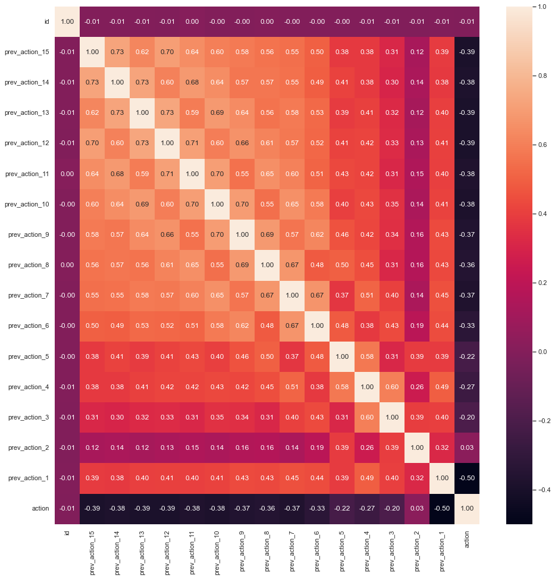
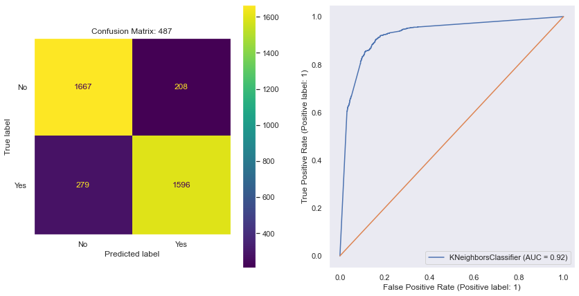
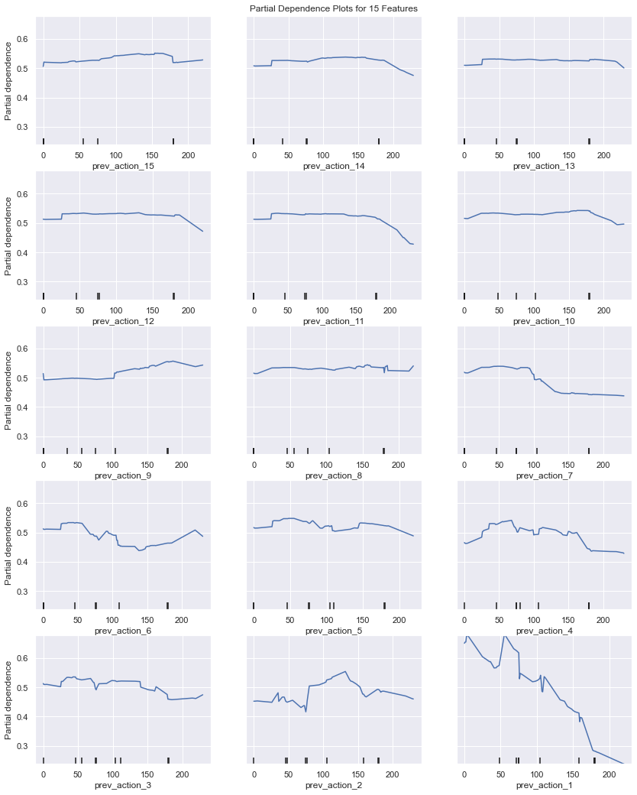
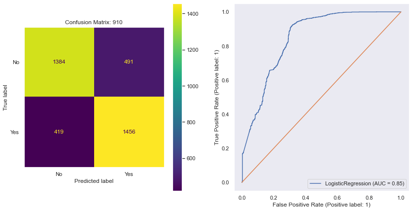
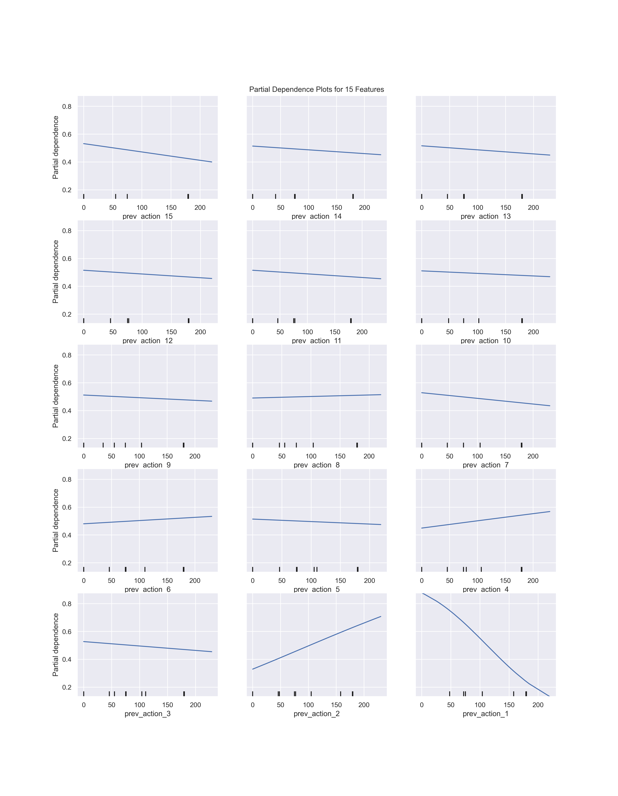
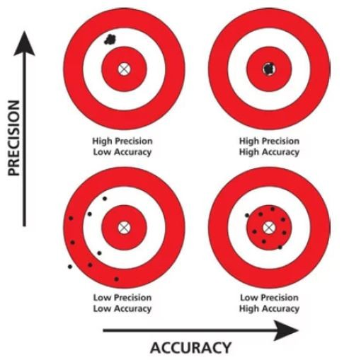

# Customer Interactions

I am using commercial datasets, therefore, I will not be able to share them publicly!

------------
# Files
The notebook files are separated to execute these functions:
1. data.eda.Aykan.ipynb is for exploratory data analysis
2. LogisticRegression.Aykan.ipynb is for executing Logistic Regression model
3. KNeighborsClassifier.Aykan.ipynb is for executing k-Nearest Neighbors model
4. DecisionTreeClassifier.Aykan.ipynb is for executing Decision Tree Classifier model

------------
## Rows and Features
Each line in the dataset contains a series of 15 previous interactions which are independent variables and a target interaction column which is the dependent variable:
* When clients are interacting with the system, typically they are on happy path but occasionally they deviate from it which may result in negative experience while impacting customer interactions, I would like to predict those negative experiences at any given time by checking past 15 customer interaction data points over 30 days, even if there is more, the set is restricted to most recent 15 actions.

The data source is customer interactions, each code represent an event, true nature of interactions is not described, though:
* I gathered such data and defined the data model what would need to look for, represented by columns as below, all features are numeric, as explained interactions are transformed into numerical codes.
* id is a unique identifier per row which bundles interactions together within the row
* prev_action_15 
through
* prev_action_1 columns
    * they contain previous interaction codes, from oldest to newest action code: prev_action_15 being oldest and prev_action_1 being most recent in the data model representation
    * If there are not enough data points in client interaction history, 0 will be placed in these previous action columns. Please note, semantically, zeros will start appearing from prev_action_15 (from oldest to newest). 0 cannot be on prev_action_1 which means no entry over 30 days for this client!
* action is the target column
* Sample data below:

|id	|prev_action_15	|prev_action_14	|prev_action_13	|prev_action_12	|prev_action_11	|prev_action_10	|prev_action_9	|prev_action_8	|prev_action_7	|prev_action_6	|prev_action_5	|prev_action_4	|prev_action_3	|prev_action_2	|prev_action_1	|action|
|---|---------------|---------------|---------------|---------------|---------------|---------------|-------------	|--------------|--------------|--------------|--------------|--------------|--------------|--------------|--------------|------|
|19059237|	104|	158|	131|	72|	179|	75|	75|	73|	180|	180|	179|	180|	75|	55|	75|	55|
|73879930|	0|	0|	0|	75|	77|	162|	75|	75|	75|	75|	75|	111|	111|	55|	75|	55|

Note to the second line entry, there are not enough entries, so, three 0s in those columns. The data columns are filled with 0s if interaction is missing.

The data is balanced, there are equal number of target values with 50% distribution.

For the capstone project, I am using series of customer interactions to predict a couple target actions:
- 142 and
- 55

to be proactive about those negative outcomes. Data is customer interaction set, they are generated when customer is actively interacting with the system, so, there are no regular intervals. It is cleaned from the data source and are all masked and generalized to avoid revealing any sensitive information. True identity, action numbers are all masked and datetime are removed, they are not linked to any actual data whatsoever.

------------

## Dependent Variable
The dependent variable `action` should be transformed to 0/1 for model execution:
 - 0 means it is a positive experience, no concern!
 - 1 means negative experience, it is a concern, may need to be proactive about this customer! 

------------

## Models

The techniques to use in analysis
* This first phase focus is binary classification, specifically the techniques I would like to utilize are
 `k-Nearest Neighbors`,
 `Logistic Regression` and
 `Decision Tree`.

The expected results
* The expected result is predicting action column in my dataset and also discover interaction patterns. In the initial phase, my approach will be two models to predict action code = `55` and `142` respectively. Optionally, the next phase will be a multi-class model to predict multi-class action code = `55` and/or `142` with probability as multinomial model but this is not a deal breaker.

Why this question is important
* This is a preliminary work in parallel to an ongoing work, I would like to apply the techniques I learnt, see if it helps in anyway to identify those patterns in the dataset, or any improvement point I could bring up comparing my results with the existing work. A working classification model is highly desired here to compare its performance with the existing outcome.
------------

# Datasets
There are 2 datasets to predict 2 different scenarios as describe above:
- dataset #1 has 4048 records, target value is `142`
- dataset #2 has 15000 records, target value is `55`

The data format is the same for both.

## Exploratory Data Analysis on Dataset #1
There are no null values in either datasets and both datasets are balanced, there are equal number of positive and negative data elements in the target column. The datasets are clean, no further processing is necessary besides the target column.

The correlation matrix on the first dataset shows there are some correlated columns:

However, a multicollinearity analysis by Variance Inflation Factor (VIF) shows only prev_action_14 and prev_action_13 features subject to it:

|Feature|	VIF|
|-------|------|
|prev_action_14|	6.003887|
|prev_action_13|	5.455881|
|prev_action_12|	4.897471|
|prev_action_11|	4.616364|
|prev_action_15|	4.582882|
|prev_action_10|	4.519793|
|prev_action_8|	4.287909|
|prev_action_9|	4.148637|
|prev_action_7|	4.111934|
|prev_action_6|	3.565778|
|prev_action_4|	3.125882|
|prev_action_5|	3.097930|
|prev_action_3|	2.545653|
|prev_action_2|	1.891978|
|prev_action_1|	1.387012|

## Exploratory Data Analysis on Dataset #2
There are no null values in either datasets and both datasets are balanced, there are equal number of positive and negative data elements in the target column. The datasets are clean, no further processing is necessary besides the target column.

The correlation matrix on the first dataset shows there are some correlated columns:

However, a multicollinearity analysis by Variance Inflation Factor (VIF) shows no cencern on any features:

|Feature|	VIF|
|-------|------|
|prev_action_12|	3.943847|
|prev_action_10|	3.752446|
|prev_action_11|	3.745441|
|prev_action_13|	3.629472|
|prev_action_9|	3.584227|
|prev_action_14|	3.466809|
|prev_action_7|	3.466056|
|prev_action_8|	3.385842|
|prev_action_15|	2.893114|
|prev_action_6|	2.831335|
|prev_action_4|	2.659121|
|prev_action_5|	2.351759|
|prev_action_3|	2.006105|
|prev_action_1|	1.606478|
|prev_action_2|	1.434281|

------------
# Initial Model Results
Results captured on the second dataset which has 15,000 records to predict whether it is `55` or not. I am focusing on minimizing mislabeling `negative experience` therefore I am evaluating models per `accuracy` and their `precision` because the cost of `false positive` is high.

The model results are shown in the following table from best to worst performer:

|Model |Accuracy|Precision|
|-------|------|-------|
|Decision Tree|0.90|0.90|
|k-Nearest Neighbors|0.87|0.86|
|Logistic Regression|0.76|0.75|

## Decision Tree
   GridSearchCV came out with `accuracy: {'criterion': 'entropy', 'max_depth': 18, 'min_samples_leaf': 1, 'min_samples_split': 3, 'random_state': 93}` on the first dataset and `roc_auc: {'criterion': 'gini', 'max_depth': 7, 'min_samples_leaf': 3, 'min_samples_split': 2, 'random_state': 93}` on the second dataset which has the lowest misclassifcation ratio of all. However, the hyperparameters on the second dataset caused more `false positives`. Running a further analysis by `{‘criterion': 'entropy', 'max_depth': 18, 'min_samples_leaf': 1, 'min_samples_split': 3, 'random_state': 93}` hyperparameters below:

Partial dependence plot:

## k-Nearest Neighbors
   GridSearchCV came out with accuracy model with parameters `{'n_neighbors': 4, 'weights': 'distance'}` on the first dataset and `accuracy: {'n_neighbors': 12, 'weights': 'distance'}` on the second dataset which has the lowest misclassification ratio of all. Running the further analysis by `{’n_neighbors': 4, 'weights': 'distance’}` hyperparameters below:

Partial dependence plot:

## Logistic Regression
   GridSearchCV came out with `{'C': 0.0001, 'penalty': 'l2', 'random_state': 93, 'solver': 'lbfgs'}` on the first dataset and `{'C': 0.0001, 'penalty': 'l2', 'random_state': 93, 'solver': 'lbfgs'}` on the second dataset which has the lowest misclassification ratio of all. Running the further analysis by `{‘C’: 0.0001, 'penalty': 'l2', 'random_state': 93, 'solver': 'lbfgs’}` hyperparameters below:

Partial dependence plot:

All 3 `partial dependence` plots aggree that `prev_action_1` and `prev_action_2` play influential role the most in those models.

## Next Steps
Those models will highlight negative customer experiences, so, `false positive` rate should be low but skipping detection of negative experience (`false negative`) is also important considering proactive outreach to customers unnecessarily not so desired on false positive cases. So, the model should minimize misclassifications therefore model `accuracy` should be high as well as the `precision`, anyway, ideally both should be high as visualized below:

The `decision tree` model is outperforming other models perhaps as it is not sensitive to multicollinearity, I have not checked how sensitive to multicollinearity other models are, I will remove multicollinearity in the datasets and try those models as next steps. Decision tree is slow to train but k-Nearest Neighbors model is slow on execution, Logistic Regression model is the fastest but worst performer in this round. Although, none of the model execution time was a concern given the dataset was 15,000 records.

Another uncertainity in the datasets may affect model results when the same set of `features` overlapping with opposite class, I will implement this check in the exploratory data analysis in the next phase.

The models are binomial currently, in the next phase I will try out multinomial models to predict negative experiences by a single model and dataset.